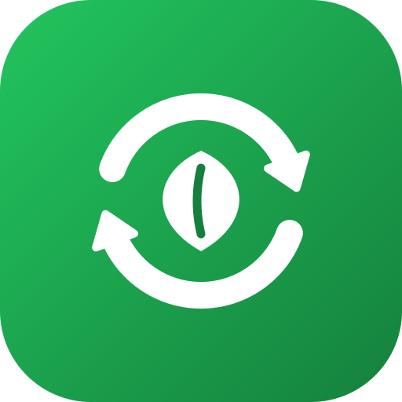

<p align="center">
  
</p>

<h1 align="center">ReSort ♻️</h1>

<p align="center">
  <strong>Snap a photo. Find the right bin. Recycle correctly.</strong><br/>
  An AI-powered recycling assistant built for <em>Earth Forward</em> — turning everyday waste confusion into measurable environmental impact.
</p>

---

## 🌍 Why ReSort — Earth Forward

Every year, millions of tons of recyclable material are lost to landfill because of one simple failure: **people put the item in the wrong bin.** Contaminated recycling streams get rejected whole-batch, and valuable materials — plastic, metal, glass, paper — end up burned or buried.

ReSort removes the guesswork. Point your camera at any item, and a vision-capable AI model tells you exactly which bin it belongs in, how to prepare it, and why. Better sorting is one of the highest-leverage, lowest-effort environmental actions a household can take — ReSort makes it effortless.

## The problem

Recycling rules confuse even people who genuinely care. The hard cases aren't "plastic bottle" or "newspaper" — they're:

- An empty hair dye bottle stained with dried dye
- A pizza box with grease on the bottom
- A pet food can with dried residue
- Old electronics — where exactly do they go?
- New deposit-return (kaucja) systems — which bottles qualify?
- Newly mandated textile collection bins

Existing solutions are searchable databases: they require users to already know what an item is called, and they miss edge cases entirely. ReSort instead **looks at the item and reasons about it** — including its condition, contamination, and material composition.

## ✨ How it works

1. Point your camera at an item (or pick from the gallery)
2. ReSort sends the photo to **Gemma 4 26B Mixture-of-Experts** via the Google AI Studio API, together with a meticulously engineered system prompt encoding a full national waste-sorting rulebook
3. The model returns **strictly validated structured JSON**: bin category, confidence, preparation steps, explanation, and edge-case notes
4. The result appears as a color-coded card matching the real bin — yellow, blue, green, brown, grey, purple, red, PSZOK, deposit, or pharmacy

The AI is defensive by design: it will say *"photo too unclear"* or *"that's not waste"* instead of guessing, and the server independently validates every field of the model's output before it reaches the screen.

## 🗂️ Twelve disposal categories

| Category | Bin color | Examples |
|---|---|---|
| `plastik_metal` | 🟡 Yellow | Plastic bottles, cans, Tetra Pak |
| `papier` | 🔵 Blue | Paper, cardboard |
| `szklo` | 🟢 Green | Glass jars, bottles |
| `bio` | 🟤 Brown | Food scraps, garden waste |
| `zmieszane` | ⚫ Grey | Mixed waste — contaminated or composite items |
| `tekstylia` | 🟣 Purple | Clothes, shoes |
| `elektroodpady` | 🔴 Red | Small electronics, batteries |
| `pszok` | 🏭 Drop-off | Large or hazardous items (municipal point) |
| `kaucja` | ♻️ Deposit | Deposit-return bottles & cans |
| `apteka` | 💊 Pharmacy | Expired or unused medications |
| `niewyrazne` | — | Photo too unclear — prompts a retake |
| `nie_odpad` | — | Photo doesn't show a waste item |

## 🎨 Design

- **Mobile-first phone-frame interface** — the entire app lives inside a realistic smartphone mockup on desktop, and runs full-bleed on real phones
- Instant camera capture via `getUserMedia`, with graceful fallback to gallery upload
- Color-coded result cards with confidence badges (high / medium / low) so users know when to trust the answer
- Live legend of every bin type, always one scroll away
- **Privacy-first**: images are processed in memory and never stored

## 🛠️ Technology

- **Next.js 16** (App Router, TypeScript, strict mode)
- **Tailwind CSS v4**
- **Gemma 4 26B MoE** (`gemma-4-26b-a4b-it`) — 26B-class reasoning at ~4B active parameters per token
- **Sharp** server-side image resizing (max 1024px, JPEG q85) before inference
- Structured output enforcement (`responseMimeType: application/json`) with **server-side field validation and a category allowlist**
- Gemma 4 *thinking-mode* handling — thought parts filtered out before parsing
- 60-second request timeout with `AbortController`, graceful error taxonomy (400/422/503/504)
- Vercel-ready serverless deployment

## 🏆 Built to score

| Judging criterion | How ReSort delivers |
|---|---|
| **Originality** | Vision-based reasoning about an item's *condition and materials* — not another searchable waste database |
| **Adherence to Track** | Direct *Earth Forward* impact: reduces waste, improves sorting accuracy, increases actual recycling rates |
| **Completion** | Fully working end-to-end flow: camera → AI → validated result → color-coded answer |
| **Learning** | Deep prompt engineering, structured-output validation, MoE model tradeoffs, camera APIs, and modern Next.js 16 / Tailwind v4 |
| **Design** | Phone-frame mockup UI, bin-color visual language, confidence badges, privacy-first UX |
| **Technology** | Multimodal LLM with structured JSON output, server-side output validation, image preprocessing pipeline |

## 🚀 Getting started

You'll need a free [Google AI Studio](https://aistudio.google.com) API key.

```bash
git clone https://github.com/robloxsagax-web/ReSort.git
cd ReSort
npm install

echo "GOOGLE_API_KEY=your_key_here" >> .env.local
echo "GOOGLE_MODEL=gemma-4-26b-a4b-it" >> .env.local

npm run dev
```

Open [http://localhost:3000](http://localhost:3000).

> **Deploying to Vercel?** Add `GOOGLE_API_KEY` and `GOOGLE_MODEL` as environment variables in your project settings.

## 🔭 Roadmap

- Location-aware, municipality-specific sorting rules
- PSZOK drop-off point locator
- On-device inference for offline use (MediaPipe / local Ollama)
- Multi-language support for broader accessibility

## License

MIT — see [LICENSE](./LICENSE).
