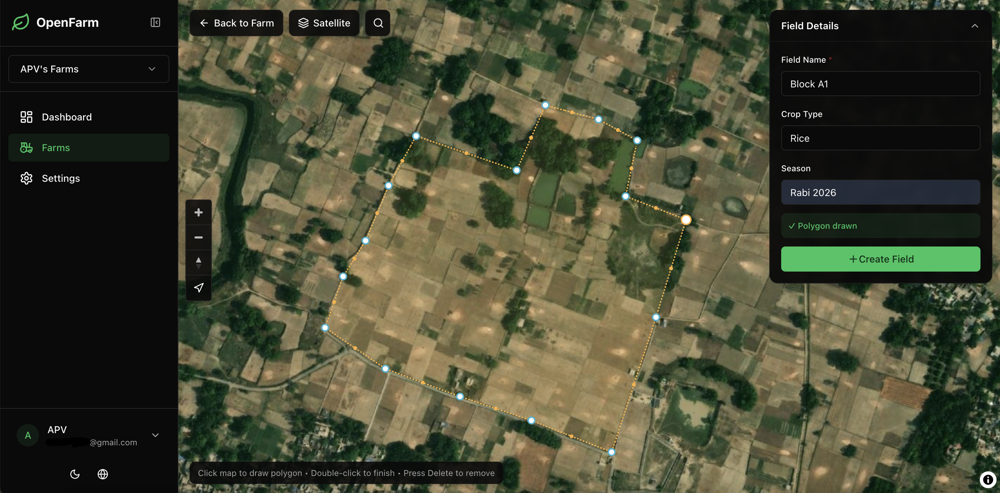

<div align="center">


# AgriPulse

### Real-time planetary monitoring for next-gen farming.

**Open-source crop intelligence: satellite imagery, weather, and soil fused into explainable, actionable insight for every field on Earth.**

[](https://devpost.com)
[](LICENSE)
[](https://github.com/robloxsagax-web/AgriPulse/actions/workflows/ci.yml)
[](https://github.com/robloxsagax-web/AgriPulse)
[](https://discord.gg/KM9qxpEmsU)

[Live Demo](https://agripulse.earth) · [Report Bug](https://github.com/robloxsagax-web/AgriPulse/issues) · [Request Feature](https://github.com/robloxsagax-web/AgriPulse/issues)

<p>
  
  
</p>
<p>
  
  
</p>

</div>

---

## 🌍 The Problem — Why "Earth Forward" Needs AgriPulse

By 2050, humanity must feed **~10 billion people** on the same — or less — farmland, while climate change makes every growing season less predictable:

- 🌡️ **Climate volatility** — droughts, floods and heatwaves now arrive faster than farmers can react.
- 💧 **Water scarcity** — agriculture consumes ~70% of global freshwater, much of it misallocated for lack of data.
- 🛰️ **The data divide** — satellites already image every field on Earth every 5 days for free, yet the analytics platforms that turn those pixels into decisions are locked behind per-hectare enterprise pricing that smallholders — who produce a third of the world's food — can never afford.
- 🌱 **Soil degradation** — a third of the planet's soils are already degraded, eroding yields and carbon stocks invisibly, below our feet.

**The planet watches every field from space. AgriPulse finally lets every farmer watch back.**

## 💡 The Solution

**AgriPulse is a free, open-source, self-hostable crop intelligence platform** that fuses Sentinel-2 satellite imagery (10 m resolution), daily weather, and global soil datasets into one explainable picture of any field — and tells you not just *what* is happening, but *why*.

Draw a field boundary on a map (or let our ML model detect it for you), and AgriPulse automatically:

1. **Backfills 24 months of vegetation history** — NDVI, EVI, SAVI, NDWI computed per scene from the public Sentinel-2 archive.
2. **Watches the field every 5 days** and raises **explained alerts** — every anomaly ships with the observation, its magnitude, its time window, and the weather + soil context behind it.
3. **Profiles the soil to 200 cm depth** (SoilGrids global / POLARIS US) and scores **68 crops** for suitability with a transparent 4-pillar model.
4. **Quantifies sustainability** — carbon sequestration potential, water balance, drought index, leaching/compaction/waterlogging risk — the metrics that turn good intentions into measurable environmental impact.

No API keys. No vendor lock-in. No per-acre fees. BSD-3-Clause.

## 🏆 Why AgriPulse Wins

| Judging criterion | How AgriPulse delivers |
|---|---|
| **Originality** | The open-source answer to precision agriculture: satellite + weather + soil fused into *explainable* per-field alerts with a self-hosted, zero-cost deployment story — crop intelligence as public infrastructure, not a subscription. |
| **Adherence to "Earth Forward"** | Directly advances sustainable agriculture (the named theme): water-balance and drought monitoring, soil carbon estimation, crop-suitability planning for a changing climate, and early stress detection that cuts waste of water, fertilizer and yield. Maps to UN SDG 2 (Zero Hunger), SDG 13 (Climate Action) and SDG 15 (Life on Land). |
| **Completion** | A real, working product: live demo at [agripulse.earth](https://agripulse.earth), one-command Docker deployment, CI-enforced code quality, i18n (EN/ES), dark mode, shareable field-health reports. |
| **Learning** | Built on a deliberately modern, teachable stack — Next.js 14, FastAPI, PostGIS, Celery, TiTiler, PyTorch — with architecture and design-system docs written for newcomers. |
| **Design** | A token-driven design system ([DESIGN.md](DESIGN.md)), IBM Plex typography, accessible dark/light themes, MapLibre maps, ECharts time series — polished enough for the field and the boardroom. |
| **Technology** | Cloud-native geospatial pipeline: STAC catalog search → COG → TiTiler tiles → PostGIS → PMTiles; PyTorch field-boundary detection (Fields of The World); async Celery processing; full RBAC multi-tenancy. |

## ✨ Feature Highlights

### 🛰️ Satellite Intelligence
- Four vegetation indices — **NDVI, EVI, SAVI (configurable L), NDWI** — from Sentinel-2 at 10 m
- Automatic **24-month historical backfill** + weekly auto-compute per field
- Reproducible, provenance-tracked pipeline: Element84 STAC → COG → TiTiler

### 🌦️ Weather Intelligence (Open-Meteo)
- Daily history + 7-day forecast: temperature, precipitation, ET₀, VPD, soil moisture/temperature
- Agronomic derivations: **Growing Degree Days, water balance, drought index**

### 🌱 Soil Intelligence
- Auto-ingestion from **SoilGrids (global, 250 m)** and **POLARIS (US, 30 m)**: texture by depth, pH, organic carbon, CEC, bulk density, available water capacity
- **Crop suitability scoring across 68 crops** (Soil 40% · Water 25% · Climate 20% · Stress 15%) with limiting-factor explanations
- Sustainability metrics: **carbon sequestration estimation**, nutrient risk zones, sampling-zone recommendations, soil×weather stress indicators

### 🤖 ML Boundary Detection
- Fields of The World (PyTorch/TorchGeo) model detects field boundaries from imagery — draw a rough area, review detections with confidence scores, accept with one click

### 🚨 Explained Alerts
- Configurable per-index thresholds and drop-percentage rules
- Every alert enriched with the weather and soil conditions that explain it — **no black boxes**

### 🗺️ Delivery
- Interactive MapLibre + PMTiles maps (**no Mapbox token needed**), per-index colormaps, scouting markers with photo upload
- ECharts time series with percentile bands; **read-only share links** for agronomists and buyers
- Google OAuth → JWT, owner/admin/member/viewer RBAC, audit logging, EN/ES i18n, dark/light themes

## 🏗️ Architecture

```
┌─────────────────────────────────────────────────────────────────┐
│  Layer C — Delivery Surfaces                    (Distribution)  │
│  Map UI · Reports · API · Webhooks · MCP · Mobile scouting      │
├─────────────────────────────────────────────────────────────────┤
│  Layer B — Intelligence Engine                        (Moat)    │
│  Phenology · Anomaly detection · Stress signals · Yield         │
│  Risk models · Soil-derived insights · Explainability           │
├─────────────────────────────────────────────────────────────────┤
│  Layer A — Observation Infrastructure          (Data Gravity)   │
│  Satellite · Weather · Soil · Field boundaries · Sensors        │
└─────────────────────────────────────────────────────────────────┘
```

**Tech stack**

```
apps/web/       → Next.js 14 · NextAuth (Google OAuth) · Tailwind · shadcn/ui · MapLibre · ECharts
services/api/   → FastAPI · SQLAlchemy 2.0 (async) · Alembic · Celery
services/tiler/ → TiTiler COG tile server (shared JWT auth)
infra           → PostgreSQL/PostGIS · Redis · MinIO · Docker Compose · Caddy (auto-SSL)
ml              → PyTorch · TorchGeo (Fields of The World boundary detection)
```

See [ARCHITECTURE.md](ARCHITECTURE.md) for the full strategic architecture.

---

## 🚀 Deploy Locally — In Depth

The entire platform runs on your machine with **one command** via Docker Compose. No cloud account, no paid API keys, no external services required beyond a free Google OAuth client for sign-in.

### Step 0 — Prerequisites

| Requirement | Version | Check with |
|---|---|---|
| Docker Engine | 24+ | `docker --version` |
| Docker Compose | v2 (plugin) | `docker compose version` |
| Node.js | 20+ *(only for local frontend dev)* | `node --version` |
| Python | 3.11+ *(only for local backend dev)* | `python3 --version` |
| Git | any recent | `git --version` |

### Step 1 — Clone

```bash
git clone https://github.com/robloxsagax-web/AgriPulse.git
cd AgriPulse
```

### Step 2 — Configure environment

```bash
cp .env.example .env
```

Only **three values must change** for a working local deployment; every other default already points at the local containers:

1. **Google OAuth credentials** (sign-in provider — free, 2 minutes):
   - Go to [Google Cloud Console → Credentials](https://console.cloud.google.com/apis/credentials)
   - *Create Credentials → OAuth client ID → Web application*
   - Add authorized redirect URI: `http://localhost:3000/api/auth/callback/google`
   - Copy the values into `.env`:
     ```bash
     GOOGLE_CLIENT_ID=xxxx.apps.googleusercontent.com
     GOOGLE_CLIENT_SECRET=xxxx
     ```

2. **Two random secrets** (generate them with OpenSSL):
   ```bash
   # Run these and paste the output into .env
   openssl rand -base64 32    # → NEXTAUTH_SECRET
   openssl rand -base64 64    # → AGRIPULSE_JWT_SECRET
   ```

That's it. Postgres, Redis, MinIO, the STAC endpoint (Element84's public Earth Search), soil datasets (SoilGrids/POLARIS) and weather (Open-Meteo) all work out of the box with public or containerized endpoints.

### Step 3 — Launch the full stack

```bash
docker compose -f docker-compose.yml -f docker-compose.dev.yml up --build
```

This starts **seven services**: PostGIS, Redis, MinIO, the FastAPI backend, the Celery worker, the TiTiler tile server, and the Next.js web app. First build takes a few minutes (GDAL/PyTorch images are large); subsequent starts are seconds.

### Step 4 — Verify everything is alive

```bash
curl http://localhost:8000/healthz     # API       → {"status":"ok"}
curl http://localhost:8080/healthz     # TiTiler   → {"status":"ok"}
curl http://localhost:3000/api/health  # Web       → ok
```

| Service | URL | Purpose |
|---|---|---|
| 🌐 Web app | http://localhost:3000 | The product — sign in and draw your first field |
| 📖 API docs | http://localhost:8000/docs | Interactive Swagger UI for every endpoint |
| 🗺️ TiTiler | http://localhost:8080 | On-the-fly satellite COG tiles |
| 🪣 MinIO console | http://localhost:9001 | Object storage admin (scouting photos, COGs) |

Open **http://localhost:3000**, sign in with Google, create a workspace, and draw a field polygon — AgriPulse immediately queues the 24-month backfill and you can watch indices appear on the map and charts within minutes.

### Step 5 — Optional: hot-reload local development

If you want to hack on the code instead of just running it:

**Frontend** (Next.js dev server with fast refresh):
```bash
cd apps/web
npm install
npm run dev          # http://localhost:3000
```

**Backend** (Uvicorn with auto-reload):
```bash
cd services/api
pip install -e ".[dev]"
alembic upgrade head                       # run DB migrations
uvicorn app.main:app --reload --port 8000
```

**Database migrations** (after changing SQLAlchemy models):
```bash
cd services/api
alembic revision --autogenerate -m "describe change"
alembic upgrade head
```

**Quality gates** (same checks CI enforces):
```bash
cd apps/web     && npm run lint && npm run type-check && npm run build
cd services/api && ruff check . && ruff format --check .
```

### Production deployment

To deploy on a real server (a free Oracle Cloud VM works perfectly — that's what runs the demo), see **[DEPLOYMENT.md](DEPLOYMENT.md)**: Terraform + cloud-init provision the VM, Docker Compose runs the stack, and Caddy issues TLS certificates automatically.

---

## 📡 API Conventions

- All endpoints prefixed with `/v1`
- Org-scoped endpoints require `X-Org-Id` header + JWT
- Pagination envelope: `{ items, total, limit, offset }`
- Geometry stored as `MultiPolygon(4326)`; soft delete via `deleted_at`
- Audit events on key actions (e.g., `field_created`)

## 🌱 Impact & What's Next

AgriPulse puts planetary-scale monitoring in the hands of the people who need it most. Next on the roadmap ([ROADMAP.md](ROADMAP.md)):

- **Yield estimation & phenology tracking** — closing the loop from monitoring to forecasting
- **Mobile scouting app** — offline-first field observations synced to the map
- **Webhooks & MCP integrations** — field intelligence inside the tools farmers already use
- **Community agronomy models** — open, peer-reviewed crop and risk models anyone can contribute

## 🤝 Contributing

We genuinely want contributors — see [CONTRIBUTING.md](CONTRIBUTING.md) for setup and PR process, [DESIGN.md](DESIGN.md) before any UI change, and [CODE_OF_CONDUCT.md](CODE_OF_CONDUCT.md) for community standards. Report vulnerabilities via [GitHub private reporting](https://github.com/robloxsagax-web/AgriPulse/security/advisories/new) (see [SECURITY.md](SECURITY.md)).

## 🙏 Acknowledgements

AgriPulse stands on decades of open data and open source — all free, all public:

**Data & imagery** — [Copernicus Sentinel-2](https://dataspace.copernicus.eu) (ESA) · [Element 84 Earth Search](https://element84.com/earth-search/) · [Open-Meteo](https://open-meteo.com) · [ISRIC SoilGrids](https://soilgrids.org) · [POLARIS](https://registry.opendata.aws/polaris/) · [Fields of The World](https://fieldsofthe.world) · [OpenStreetMap](https://www.openstreetmap.org/copyright) & [Protomaps](https://protomaps.com)

**Backend** — Python · FastAPI · SQLAlchemy · Alembic · Celery · PostgreSQL · PostGIS · Redis · MinIO · GDAL · rasterio · TiTiler · PyTorch · TorchGeo · OSGeo

**Frontend** — Next.js · React · TypeScript · Tailwind CSS · shadcn/ui · Lucide · MapLibre GL · Apache ECharts · Auth.js · next-intl

**Infrastructure** — Docker · Caddy · Terraform · Ubuntu · GitHub Actions

## 📄 License

BSD-3-Clause — see [LICENSE](LICENSE). Free forever, for every farmer on Earth. 🌍
